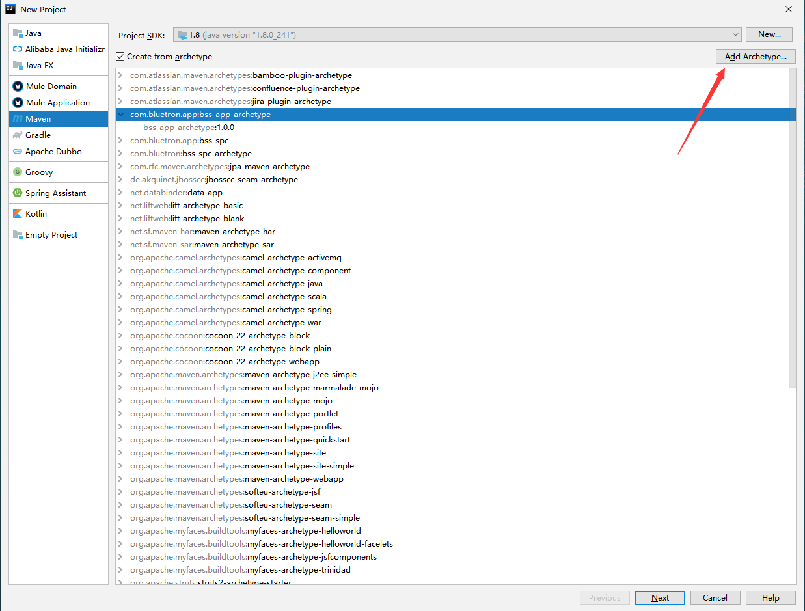
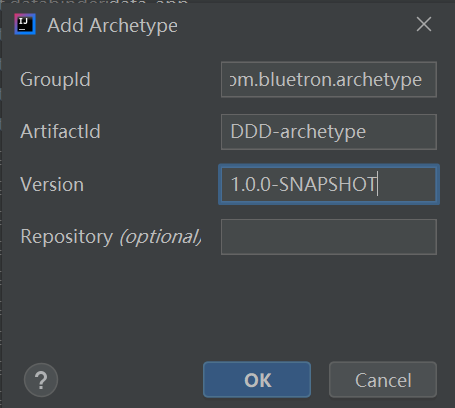
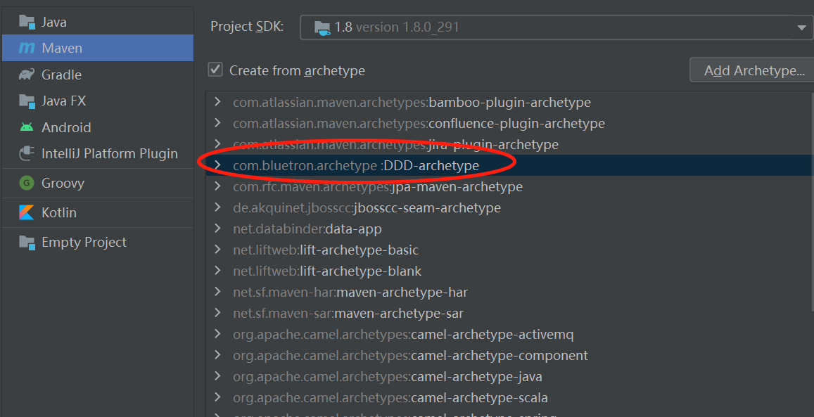
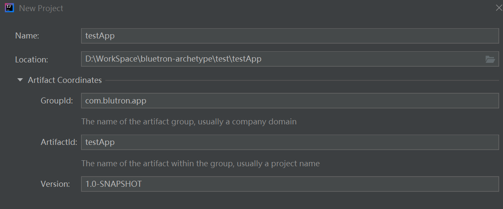
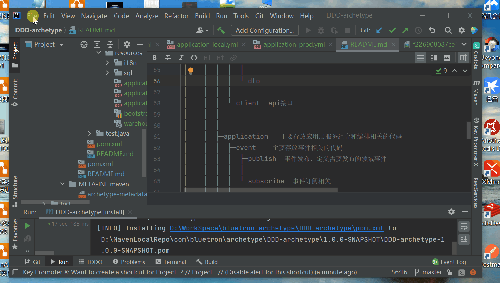

## DDD-archetype
本工程为应用研发部maven archetype项目,皆在简化工程搭建，规范项目结构.

## 使用说明

### maven命令创建项目
#### 在你的工程目录下执行命令
mvn archetype:generate -DgroupId=`com.bluetron.app.autopart` -DartifactId=`testApp` -Dversion=`1.0.0-SNAPSHOT`
-Dpackage=`com.bluetron.app.autopart.testApp` -DarchetypeGroupId=com.bluetron.archetype -DarchetypeArtifactId=DDD-archetype
-DarchetypeVersion=1.0.0-SNAPSHOT

#### 标记部分项目groupId、artifactId、package、version需要自行指定

### IDEA 使用说明
#### 初次使用请配置本步骤
1. New Project -> Maven -> Add Archetype，如图


2. 填入archetype信息，如图
```pom
<dependency>
  <groupId>com.bluetron.archetype</groupId>
  <artifactId>DDD-archetype</artifactId>
  <version>1.0.0-SNAPSHOT</version>
</dependency>
```


#### 创建项目
1. 选择com.bluetron.archetype:DDD.archetype骨架


2. 填入工程信息，完成工程创建


## 生成项目的结构
```
${rootArtifactId}
│ 
├─${rootArtifactId}-service  服务后台
│    ├─src/main/java  模块
│	 │ 	│  
│	 │ 	├─adapter    主要存放用户接口层与前端交互、展现数据相关的代码
│	 │	│  ├─web    处理web请求
│	 │	│  │  ├─assembler    实现 DTO 与领域对象之间的相互转换和数据交换
│	 │	│  │  │           
│	 │	│  │  ├─controller   http restful提供的粗粒度的接口，将用户请求委派给一个或多个应用服务进行处理。
│	 │	│  │  │      
│	 │	│  │  └─dto  数据传输的载体，内部不存在任何业务逻辑，通过DTO屏蔽领域对象
│	 │	│  │ 
│	 │	│  ├─mobile  处理移动端请求
│	 │	│  │  ├─assembler
│	 │	│  │  │            
│	 │	│  │  ├─controller
│	 │	│  │  │      
│	 │	│  │  └─dto
│	 │	│  │
│	 │	│  └─client  api接口
│	 │	│
│	 │	│             
│	 │	├─application   主要存放应用层服务组合和编排相关的代码
│	 │	│  ├─event    主要存放事件相关的代码
│	 │	│  │  ├─publish  事件发布，定义需要发布的领域事件
│	 │	│  │  │      
│	 │	│  │  └─subscribe  事件订阅相关
│	 │	│  │          
│	 │	│  ├─service  应用服务，对多个领域服务进行封装、编排和组合，外部微服务调用也放置于此，极薄的一层，没有业务逻辑
│	 │	│  │
│	 │	│  └─query  读写分离，查询服务可以绕过领域层操作基础设施层  
│	 │	│   
│	 │	│          
│	 │	├─domain        主要存放领域层核心业务逻辑相关的代码
│	 │	│  ├─aggregateXXX  聚合根目录，根据聚合名称命名
│	 │	│  │    ├─model   存放聚合根、实体、值对象相关代码，实体类采用充血模型
│	 │	│  │    │      
│	 │	│  │    ├─repository  聚合对应的仓储接口
│	 │	│  │    │      
│	 │	│  │    └─service  存放领域服务、工厂模式（Factory），用于创建领域对象、非领域对象本身行为等，向上供应用服务调用
│	 │	│  │
│	 │	│  ├─... 多个聚合平行放置于domain下
│	 │	│  │    ├─model
│	 │	│  │    │      
│	 │	│  │    ├─repository
│	 │	│  │    │      
│	 │	│  │    └─service
│	 │	│  
│	 │	│              
│	 │	├─infrastructure  主要存放基础资源服务相关的代码
│	 │	│  ├─aggregateXXX  聚合根目录，根据聚合名称命名，存放聚合内仓储实现及po对象
│	 │	│  │      
│	 │	│  ├─config  配置相关，共性的需要移至xxx-common
│	 │	│  │      
│	 │	│  ├─util    公共服务，共性的需要移至xxx-common
│	 │	│  │   ├─cache  抽象封装缓存中间件
│	 │	│  │   │      
│	 │	│  │   ├─job    抽象封装任务中间件
│	 │	│  │   │      
│	 │	│  │   ├─mq     抽象封装消息中间件
│	 │	│  │   │   
│	 │	│  │   └─...  其它
│    │ 
│    └─src/main/resources 
│        ├─sql                数据库初始化文件
│        ├─i18n               国际化翻译文件
│        └─application.yml    全局配置文件
│       
│ 
├─${rootArtifactId}-api   API服务
|    ├─client   client 客户端调用,对外暴露的openFeign接口  
|    ├─dto      DTO 数据传输对象
|    ├─common   枚举类
|
```
## 效果演示


## 版本
* 1.0.0 首发版本

## 联系作者
* chenqingfeng@supos.com


